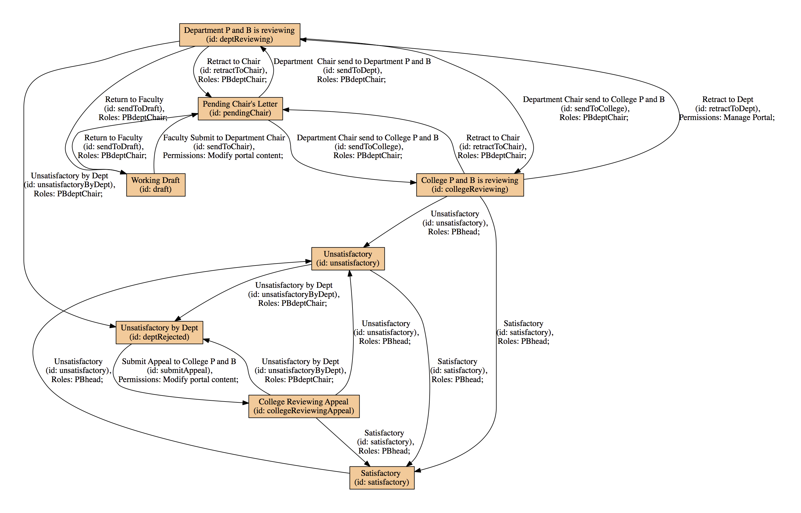
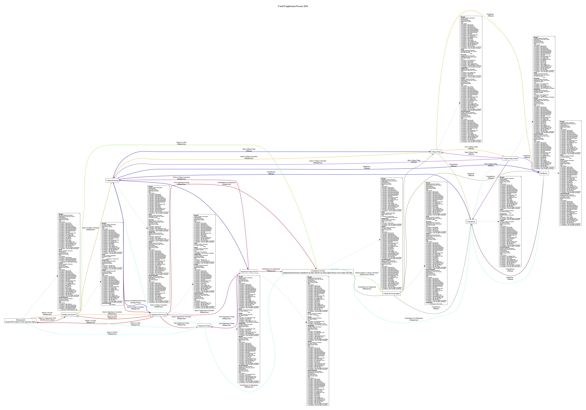

**yc.facultycv**
---------------

This Plone Add-on is a dexterity revision of the original Products.FacultyCV. A revision was made because the key features in Archetypes which are heavily supported by the original FacultyCV have now been deprecated and no longer being supported. Also, the newer versions of Plone (versions 6 or later) will not support Archetypes, hence this is why this version was created. This add-on implements four different views (Profile Default, CV, EnhancedCV, and Profile Staff). The Faculty content type uses the Profile Default, CV, and EnhancedCV views. The Staff content type uses the Profile Staff view.

Features
--------

- Four Views (Profile-Default, CV, EnhancedCV, and Profile Staff).

- Implements a newer voting system using Plone Restapi endpoints. This is key as it allows functionality in Plone's React JavaScript frontend Volto.

- Uses similar workflows as the FacultyCV original with the difference being they have been updated to work in this newer addon.

- 
- 

- The above chart still applies in this current addon.

Examples
--------

This add-on can be seen in action at the following sites:
https://www.york.cuny.edu/directory

Requirements
------------

- plone 6.0 or later

- yc.facultycv plone add-on 1.0 or later
Installing plone add-on
-----------------------
production
=======

- source bin/activate

- pip install git+https://github.com/rnunez80/yc.facultycv.git@main

development
=======

- cd src

- git clone https://github.com/rnunez80/yc.facultycv.git

- cd yc.facultycv

- pip install -e .
Installing volto add-on
-----------------------

- cd src/addons

- git clone https://github.com/rnunez80/volto-facultycv.git

- cd ../..

- nano package.json

add "volto-facultycv" in the package.json file under "addons": [

- yarn install

- yarn start or yarn build

License
-------

The project is licensed under the GPLv2.

